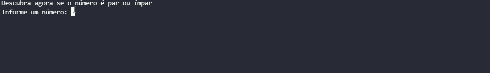

# ✔️ Project
This is a project that contains 5 exercises made for my Computer Science Bachelor 

## Interface 
### Ex1
<h1 align="center">
    
</h1>
### Ex2
<h1 align="center">
    
</h1>

# 💻 Technologies
- **PYTHON**

# 📝 License
This project have the license of the [MIT](./LICENSE).
